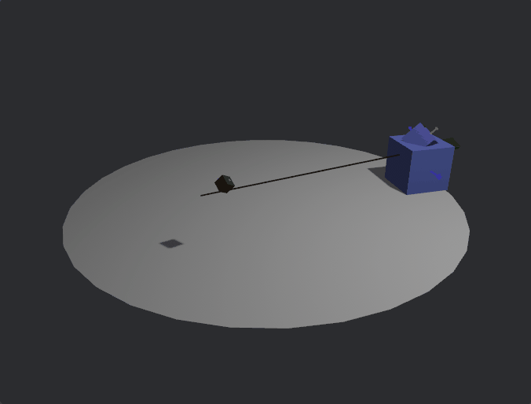

# bevy_mod_lookat

[](https://crates.io/crates/bevy_ui_anchor)
[](https://docs.rs/bevy_ui_anchor)
[](https://opensource.org/licenses/MIT)
e

A Bevy Plugin and library to help with rotating an entity towards a target even through hierarchies



## Features

- Updates an entities rotation in the world towards another entity or target

| Bevy version | Crate version |
| ------------ | ------------- |
| 0.15         | 0.2           |
| 0.14         | 0.1           |

## Example

``` rust
//! A simple 3D scene with light shining over a cube sitting on a plane.
#![feature(test)]
extern crate test;
use bevy::{color::palettes::css::*, prelude::*, render::primitives::Aabb};
use bevy_mod_lookat::*;

fn main() {
    App::new()
        .add_plugins(DefaultPlugins)
        .add_plugins(RotateTowardsPlugin)
        .add_systems(Startup, setup)
        .add_systems(Update, (mover, rotate, draw_axes, draw_forward))
        .run();
}

#[derive(Component)]
struct Move;

#[derive(Component)]
struct Rotate;

#[derive(Component)]
struct ShowAxes;

#[derive(Component)]
struct ShowForward;

fn draw_axes(mut gizmos: Gizmos, query: Query<(&GlobalTransform, &Aabb), With<ShowAxes>>) {
    for (&transform, &aabb) in &query {
        let t = transform.compute_transform();

        let length = aabb.half_extents.length();
        gizmos.axes(t, length);
    }
}
fn draw_forward(mut gizmos: Gizmos, query: Query<&GlobalTransform, With<ShowForward>>) {
    for &transform in &query {
        let t = transform.compute_transform();

        gizmos.line(
            t.translation,
            t.translation + t.forward() * 6.0,
            Color::BLACK,
        );
    }
}
fn rotate(mut query: Query<&mut Transform, With<Rotate>>, time: Res<Time>) {
    for mut transform in &mut query {
        transform.rotate_y(time.delta_secs() / 2.);
        transform.rotate_x(time.delta_secs());
    }
}
fn mover(time: Res<Time>, mut ents: Query<&mut Transform, With<Move>>) {
    let distance = 2.0;
    for mut ent in ents.iter_mut() {
        ent.translation.x = distance * f32::sin(time.elapsed().as_secs_f32());
        ent.translation.z = distance * f32::cos(time.elapsed().as_secs_f32());
        ent.translation.y = 1.5 + 0.5 * distance * f32::cos(3.0 * time.elapsed().as_secs_f32());
    }
}
/// set up a simple 3D scene
fn setup(
    mut commands: Commands,
    mut meshes: ResMut<Assets<Mesh>>,
    mut materials: ResMut<Assets<StandardMaterial>>,
) {
    // circular base
    commands.spawn((
        Mesh3d(meshes.add(Circle::new(4.0))),
        MeshMaterial3d(materials.add(Color::WHITE)),
        Transform::from_rotation(Quat::from_rotation_x(-std::f32::consts::FRAC_PI_2)),
    ));

    let target_id = commands
        .spawn((
            Mesh3d(meshes.add(Cuboid::new(0.2, 0.2, 0.2))),
            MeshMaterial3d(materials.add(Color::from(DARK_RED))),
            Transform::from_xyz(1.0, 0.5, 1.0),
            Move,
            Rotate,
            ShowAxes,
        ))
        .id();

    // cube
    commands
        .spawn((
            Mesh3d(meshes.add(Cuboid::new(1.0, 1.0, 1.0))),
            MeshMaterial3d(materials.add(Color::srgb_u8(124, 144, 255))),
            Transform::from_xyz(3.5, 0.5, 0.0),
            ShowAxes,
        ))
        .with_children(|commands| {
            commands
                .spawn((
                    Mesh3d(meshes.add(Cuboid::new(0.5, 0.5, 0.5))),
                    MeshMaterial3d(materials.add(Color::srgb_u8(124, 100, 255))),
                    Transform::from_xyz(0.0, 0.5, 0.0),
                    Rotate,
                    ShowAxes,
                ))
                .with_children(|parent| {
                    parent.spawn((
                        Mesh3d(meshes.add(Cuboid::new(0.3, 0.1, 2.0))),
                        MeshMaterial3d(materials.add(Color::from(GREEN))),
                        Transform::from_xyz(0.0, 0.7, 0.0),
                        RotateTo {
                            entity: target_id,
                            // this choses what the flat side should be in relation towards
                            updir: UpDirection::Parent,
                        },
                        ShowForward,
                    ));
                });
        });
    // light
    commands.spawn((
        PointLight {
            shadows_enabled: true,
            ..default()
        },
        Transform::from_xyz(4.0, 8.0, 4.0),
    ));
    // camera
    commands.spawn((
        Camera3d::default(),
        Transform::from_xyz(-2.5, 4.5, 9.0).looking_at(Vec3::ZERO, Vec3::Y),
    ));
}

#[cfg(test)]
mod tests {
    use super::*;
    use test::bench::Bencher;

    #[bench]
    fn bench(b: &mut Bencher) {
        let mut app = App::new();
        app.add_plugins(MinimalPlugins);
        let mut commands = app.world_mut().commands();
        // circular base
        commands.spawn(SpatialBundle {
            transform: Transform::from_rotation(Quat::from_rotation_x(
                -std::f32::consts::FRAC_PI_2,
            )),
            ..default()
        });

        for i in 0..100 {
            let target_id = commands
                .spawn((
                    SpatialBundle {
                        transform: Transform::from_xyz(i as f32 * 1.0, 0.5, 1.0),
                        ..default()
                    },
                    Move,
                    Rotate,
                ))
                .id();

            // cube
            commands
                .spawn((SpatialBundle {
                    transform: Transform::from_xyz(3.5, 0.5, i as f32 * 1.0),
                    ..default()
                },))
                .with_children(|commands| {
                    commands
                        .spawn((
                            Rotate,
                            SpatialBundle {
                                transform: Transform::from_xyz(0.0, i as f32 * 0.5, 0.0),
                                ..default()
                            },
                        ))
                        .with_children(|parent| {
                            parent.spawn((
                                SpatialBundle {
                                    transform: Transform::from_xyz(0.0, i as f32 * 0.7, 0.0),
                                    ..default()
                                },
                                RotateTo {
                                    entity: target_id,
                                    // this choses what the flat side should be in relation towards
                                    updir: UpDirection::Parent,
                                },
                                ShowForward,
                            ));
                        });
                });
        }

        app.add_plugins(RotateTowardsPlugin)
            .add_systems(Update, (mover, rotate));

        // move past the Startup state
        for i in 0..20 {
            app.update();
        }

        b.iter(|| {
            app.update();
        });
    }
}
```
